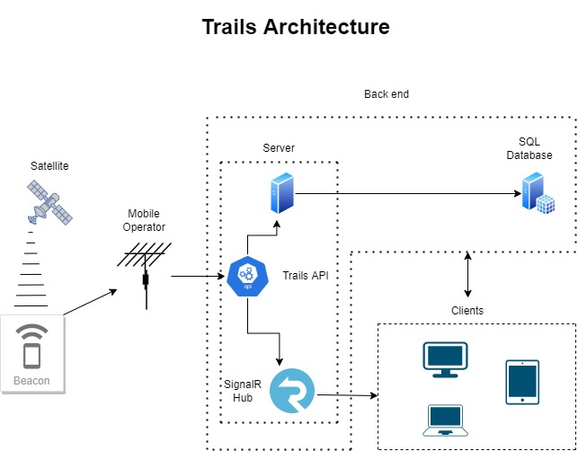

# Trails - Live GPS Tracking System For Sport Events In The Open

## Live at: https://trailslive.net/
## Api Endpoint at: https://trailslive.net/beacon/data

## SoftUni Tester Credentials

*For Api test you can use predefined Postman request included in this repo*

User:
* email: softuni@softuni.bg
* pass: 123456

Admin:
* email: admin@trailslive.net
* pass: 123456

Beacon:
* Imei: 000000000000000
* AuthKey: n6qmVk8nZFSerD9Q11CQ5ejSihVSIo9g

## Author

 [Hristo Topalov](https://www.linkedin.com/in/hristo-topalov/)

Demo project for creating, managing and conducting race competitions in the open (Running, Skiing, Hiking, Cycling... etc) and almost every type of sport which is involved with moving vast amounts of kilometers in the open(mountains, woods, rivers and etc.).Participants are tracked by GPS receivers and watched live by application users.

## Roles

* Guest
* User
* Participant
* Administrator

## Getting Started

Site guest (**visitor**) options:
* can only visit Info pages (*Home for guest user*, *Contact Us*, *Register*, *Login*, *Statistics* and *Faq page*) and can send e-mail from contact form to site owner(Administrator).

**Registered user** options:
* can create events and routes, apply for events. If creator he can approve applicants for event, edit the event and route for it until dead line before start of event.
* has separate section for his events.
* gains access to live events section where he can watch currently conducted events.
* profile page where he can edit his data and change password if needed. 

**Administrator** options:
* Can access system through separate area giving him more options.(Admin Panel)
* Can approve or decline events by users.
* Can approve participants for events.
* Can edit events
* Can add new GPS receivers(Beacon) to the system, modify or delete existing ones.   
* Can connect participants to Beacons for events that are about to be conducted or detach Beacons from passed events. 

**User with forgot credential**
* can access reset password functionality in order to gain access to system again.

## Template Layout

* *Free template from the web* - https://github.com/startbootstrap/startbootstrap-freelancer

## Project technology stack

### Programming Languages
* C#
* Java Script
* C++
* T-SQL
* HTML
* CSS

### Frameworks

* ASP.NET 6 - https://dotnet.microsoft.com/en-us/apps/aspnet
* Entity Framework 6 - https://docs.microsoft.com/en-us/ef/
* MS SQL Server 2019 - https://www.microsoft.com/en-us/sql-server/sql-server-2019
* Bootstrap - https://getbootstrap.com/

### Packages
* AutoMapper - https://automapper.org/
* Age Calculator - https://github.com/arman-g/AgeCalculator
* SignalR - https://dotnet.microsoft.com/en-us/apps/aspnet/signalr
* NUnit - https://nunit.org/
* XUnit - https://xunit.net/
* SendGrid - https://sendgrid.com/
* BundlerMinifier - https://github.com/madskristensen/BundlerMinifier

### Java Script Libraries
* Leaflet JS - https://leafletjs.com/
* Chart.js - https://www.chartjs.org/
* SignalR JS Client - https://docs.microsoft.com/en-us/aspnet/core/signalr/javascript-client?view=aspnetcore-6.0&tabs=visual-studio
* JQuery validation - https://jqueryvalidation.org/
* JQuey validation unobtrusive

### External Providers
* Open Street Maps - https://www.openstreetmap.org

## Used techniques
* MVC
* Services
* Web Api
* AJAX
* In-Memory Cache
* Extentions to Web Application Builder
* Extensions to Web Application Factory for anonymous and authenticated requests (Used in Integration testing)
* Antiforgery Token Extractor for post request during testing
* InMemory Database testing
* Automatic Administrator Seed to DB when app is deployed
* TempData message for notifications
* AJAX Loader during requests for user experience while loading larger amounts of data
* Parallel queries(PLINQ) for detaching beacons from participants faster
* Eager Loading when using Entity Framework to avoid N + 1 problem and have more control over data
* Mapping domain models to view or service models to avoid leakage of unnecessary properties to users and reduce data transfer.
* Parsing uploaded gpx files from user on his client(browser) to reduce server load and avoid storing unnecessary files in database -> after parsing the file, system stores only gps important data(latitude, longitude and etc.) 
* Bundle and minification of JS scripts to reduce size and count of queries when loading view

## Application Layers
* Data layer
* Business layer
* Presentation layer

## Custom data processors
* GPX Serializer(C#)
* GPX Parser(JavaScript)

## Custom Security Addons
* Security Provider with ability to generate and hash keys for Beacons which are registered in the system
* Filter to authenticate only registered Beacons to system and allow them to send data for events

## Advantages to existing systems
* Full automation of creating events applying for them and approving them by user and administrator.
* Automation of process to connect applied participants with Beacons with single click. (No need for paper lists done by hand and delivered to administrator)
* Remove old(unnecessary) beacon data automatically by stored procedure runned once every day to clean up database

## Data integration with other applications
** Trails GPX Processor generates gpx files fully compatible with applications like:
* Strava - https://www.strava.com/
* Garmin Connect - https://connect.garmin.com/
* Suunto Link - https://www.suunto.com/Support/software-support/suuntolink/
* Garmin BaseCamp - https://www.garmin.com/en-US/software/basecamp/
* Polar Flow - https://flow.polar.com/
* Google maps - https://www.google.com/maps
 and etc.

 ## TODO list:
 * Develop mobile application to add ability to tag participant's timestamp by event volunteers on checkpoint pass on the route during event(if needed) an get the ability to have realtime timing for accurate rankings
 * Eventually add payment to the system for creating and conducting events in order to be self-sustained (costs for hosting, gps expenses(parts, sim card payments and so on)) not earning money from it.

## Project Architecture

## Typical Workflow

User creates event and route and after filling all the necessary data waits for administrator's approval. During waiting period event is not visible to users. After event is approved by administrator, creator can modify or delete event until 3 days before its start. He can also approve any applied participants for the event. During the conduct of the event creator can't delete or modify it. After event's end user can delete it if he wants to. Time period of 3 days lockdown is given for administrator to have technological time to add beacons to participants, reprogram or fix Beacons if he needs to and organize his plans for getting to event's location, connecting with creator, giving him the Beacons and etc. After event's end users can download gpx files with the paths of participants.

Administrator's typical workflow includes:
* Managin events created by users of the system - approves or declines them.
* Managing Beacons - add, delete or modify them.(Beacons that are part of currently conducted event can't be delete or modified).
* Connecting Beacons to participants for future events- during 3 day lockdown period events will show up along with their participants and available Beacons in the system.  

## Samples

**Home**
 

**Route details**
 

**Administration**
 

**Live Broadcast**
 

**Beacon**

